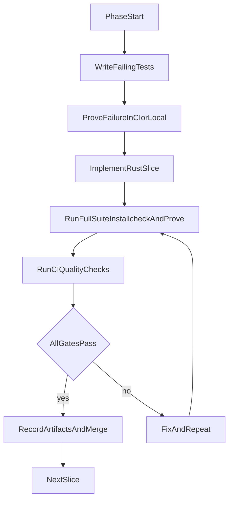

# Phased pgvector C-to-Rust Migration Plan

## Scope and Constraints

- Target: full migration of extension internals from C to Rust without a big-bang cutover.
- Strategy: start with a short evaluation phase, then proceed with incremental module replacement behind stable ABI boundaries.
- Hard compatibility requirement: strict behavior/perf parity across the current CI PostgreSQL support range.
- Existing assets to preserve as gates:
  - Build entrypoint: `[Makefile](Makefile)`
  - Extension SQL/API surface: `[sql/vector.sql](sql/vector.sql)`
  - Core extension entrypoint/module layout: `[src/vector.c](src/vector.c)`
  - Regression suite: `[test/sql](test/sql)`, expected outputs: `[test/expected](test/expected)`
  - TAP/integration suite: `[test/t](test/t)`
  - CI matrix and quality checks: `[.github/workflows/build.yml](.github/workflows/build.yml)`

## Agent Execution Model (Persistent, Long-Running)

- Work in small PR-sized increments; one migration slice per cycle.
- For each slice, agent must follow this invariant:
  1. Add or update tests so at least one new test is initially failing against current implementation for the intended Rust behavior/safety/property.
  2. Implement Rust slice + bridge changes.
  3. Run full existing suite (`make installcheck` and `make prove_installcheck`) and required quality checks.
  4. Only mark phase item complete when all gates pass and artifacts are produced.
- Keep a migration ledger in repo docs (phase status, gate results, rollback notes).

## Phase 0 - Evaluation and Architecture Decision

- Objective: decide between hybrid path options and lock migration architecture with measurable criteria.
- Candidate implementations to evaluate:
  - Option A: Rust static/shared library linked by PGXS, C thin wrappers at PostgreSQL call boundary.
  - Option B: pgrx-centric path.
- Required outputs:
  - ADR documenting final architecture decision, risk register, and rollback strategy.
  - Proof-of-concept branch with one tiny callable Rust function invoked from existing C extension path.
- Failing-tests-first requirement:
  - Add at least one new regression/TAP test that defines expected behavior for the PoC bridge and initially fails before bridge implementation.
- Test gate:
  - `make installcheck`
  - `make prove_installcheck`
  - CI parity with existing required jobs in `[.github/workflows/build.yml](.github/workflows/build.yml)`, including scan-build and valgrind jobs.
- Done means:
  - Architecture decision is committed, PoC test now passes, and full suite is green with no required-check regressions.

## Phase 1 - Dual Toolchain Foundation (No Behavioral Change)

- Objective: introduce reproducible Rust build integration while preserving current behavior.
- Work items:
  - Add Rust crate(s) for internal logic and wire into PGXS build without changing SQL-visible behavior.
  - Establish FFI conventions (error handling, memory ownership, panic boundaries, symbol naming).
- Required outputs:
  - Build docs for local and CI execution.
  - Initial safety policy for FFI (`unsafe` boundaries and review checklist).
- Failing-tests-first requirement:
  - Add tests for bridge-level error propagation and edge handling that fail before implementation.
- Test gate:
  - Full regression + TAP suites.
  - Full CI matrix unchanged in breadth.
- Done means:
  - Rust artifacts build deterministically in all CI environments; all existing tests pass; new bridge tests pass.

## Phase 2 - Migrate Pure Utility/Math Kernels First

- Objective: migrate low-coupling compute utilities before PostgreSQL-heavy surfaces.
- Initial targets:
  - Bit/half/vector utility logic from `[src/bitutils.c](src/bitutils.c)` and `[src/halfutils.c](src/halfutils.c)` equivalents.
- Required outputs:
  - Rust utility modules with property-focused unit tests for numerical equivalence and boundary cases.
- Failing-tests-first requirement:
  - Add Rust unit tests + SQL/TAP coverage for tricky edge cases (NaN handling, overflow boundaries, extreme dimensions) that initially fail.
- Test gate:
  - Full existing suite plus new utility-focused tests.
  - No warnings/errors in existing CI quality jobs.
- Done means:
  - Utility paths are served by Rust implementations with parity demonstrated by passing full suite and new edge-case tests.

## Phase 3 - Migrate Core Dense Vector Type Path

- Objective: move dense vector operations and parsing/serialization internals to Rust while keeping SQL ABI stable.
- Primary area:
  - `[src/vector.c](src/vector.c)` internals behind unchanged SQL function declarations in `[sql/vector.sql](sql/vector.sql)`.
- Required outputs:
  - Compatibility map of each SQL function to Rust implementation status.
  - Bench parity report for representative vector operations.
- Failing-tests-first requirement:
  - Add new failing tests for parsing strictness, binary I/O roundtrips, and operator semantics before switching implementations.
- Test gate:
  - Full regression + TAP suites.
  - CI matrix must stay fully green, including valgrind and scan-build.
- Done means:
  - Dense vector internals are Rust-backed, SQL-visible behavior unchanged, parity tests and full suite pass.

## Phase 4 - Migrate Additional Types (halfvec, bitvec, sparsevec)

- Objective: complete type-system migration in independent slices.
- Targets:
  - `[src/halfvec.c](src/halfvec.c)`
  - `[src/bitvec.c](src/bitvec.c)`
  - `[src/sparsevec.c](src/sparsevec.c)`
- Required outputs:
  - Per-type migration checklist with edge-case matrix (input validation, casts, operators, indexing interactions).
- Failing-tests-first requirement:
  - For each type, add at least one new failing regression test and one failing TAP/integration test for non-obvious corner cases.
- Test gate:
  - Full suite after each type slice; no batching multiple type migrations into one unverified jump.
- Done means:
  - All three type internals migrated, each slice validated by initially failing tests that now pass and by full-suite pass.

## Phase 5 - IVFFlat Migration

- Objective: migrate IVFFlat implementation in sub-phases (build, insert, scan, vacuum, utils).
- Targets:
  - `[src/ivfflat.c](src/ivfflat.c)`, `[src/ivfbuild.c](src/ivfbuild.c)`, `[src/ivfinsert.c](src/ivfinsert.c)`, `[src/ivfscan.c](src/ivfscan.c)`, `[src/ivfvacuum.c](src/ivfvacuum.c)`, `[src/ivfutils.c](src/ivfutils.c)`
- Required outputs:
  - Recall/parity report vs baseline and WAL/vacuum behavior verification notes.
- Failing-tests-first requirement:
  - Add failing tests for ANN recall invariants, WAL replay scenarios, vacuum edge behavior before each sub-slice implementation.
- Test gate:
  - Full regression + TAP suites including IVFFlat-specific TAP files.
  - CI required checks all green.
- Done means:
  - IVFFlat path is Rust-backed with demonstrated behavioral parity and full-suite green status.

## Phase 6 - HNSW Migration

- Objective: migrate HNSW path in sub-phases mirroring IVFFlat discipline.
- Targets:
  - `[src/hnsw.c](src/hnsw.c)`, `[src/hnswbuild.c](src/hnswbuild.c)`, `[src/hnswinsert.c](src/hnswinsert.c)`, `[src/hnswscan.c](src/hnswscan.c)`, `[src/hnswvacuum.c](src/hnswvacuum.c)`, `[src/hnswutils.c](src/hnswutils.c)`
- Required outputs:
  - Determinism/recall consistency report and operational behavior notes (vacuum, duplicates, filtering).
- Failing-tests-first requirement:
  - Add failing tests around graph maintenance corner cases, duplicate handling, and filter behavior before each implementation slice.
- Test gate:
  - Full existing test suite and all CI required jobs.
- Done means:
  - HNSW implementation is Rust-backed; new HNSW tests pass; all legacy tests remain green.

## Phase 7 - Decommission C Implementations and Harden

- Objective: remove obsolete C internals, keep only minimal ABI glue if still needed, and finalize hardening.
- Work items:
  - Delete dead C code paths once equivalent Rust paths are proven.
  - Tighten unsafe boundaries and add final documentation for maintenance/onboarding.
- Required outputs:
  - Final migration report (module-by-module status, removed files, retained shims, risk notes).
  - Long-term maintenance guide for Rust + PostgreSQL API interaction.
- Failing-tests-first requirement:
  - Add failing regression tests for previously bug-prone scenarios discovered during migration; pass them before final cleanup completion.
- Test gate:
  - Full suite green on every required CI job across supported PostgreSQL versions/platforms.
- Done means:
  - No legacy C implementation remains for migrated functionality, all gates pass, and operational documentation is complete.

## Global Exit Criteria

- Every phase has recorded evidence of:
  - new tests that initially failed,
  - implementation change that made those tests pass,
  - passing full existing test suite,
  - passing required CI quality checks.
- Coverage requirement:
  - establish baseline line/function coverage before first migration slice and publish coverage artifact each phase.
  - do not regress baseline coverage for touched areas in any phase.
  - final migration requires >=90% line coverage and >=85% function coverage for migrated Rust modules; any exception must be explicitly approved and linked to a committed follow-up test plan with owner and due phase.
- SQL/API compatibility remains stable unless an explicit, approved change proposal is merged with migration scripts and tests.
- Migration ledger shows no open parity or safety blockers.

